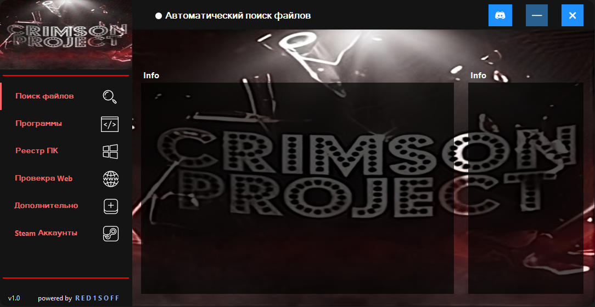
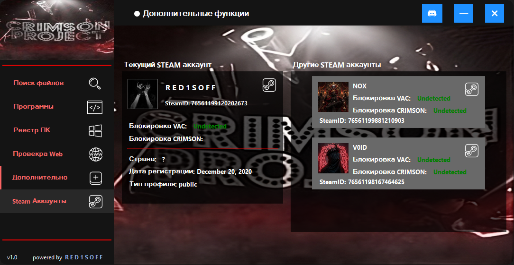
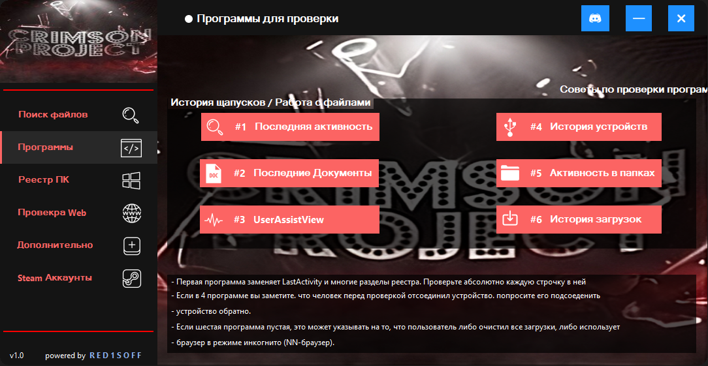
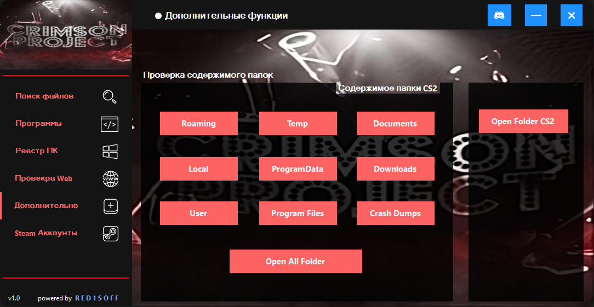
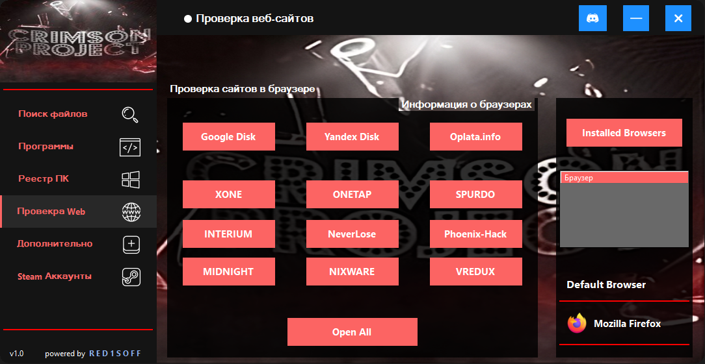

# 🎮 Steam Account Checker


Быстрый и удобный чекер аккаунтов Steam на языке C#, предназначенный для проверки валидности учетных записей.

<p align="center">
  
</p>

## Особенности
 **Высокая производительность** благодаря возможностям C#.
 **Валидация Steam:** парсинг основных данных аккаунта (`SteamAccount.cs`).
 **Удобное логирование:** четкий вывод результатов проверки в консоль/файл.

## Требования и запуск

### Системные требования
* [.NET SDK](https://dotnet.microsoft.com/ru-ru/download) (рекомендуется последняя версия LTS).
* Visual Studio / Rider или CLI для сборки.

### Запуск через консоль
1. Клонируйте репозиторий:
   ```bash
   git clone https://github.com
   ```
2. Перейдите в папку проекта:
   ```bash
   cd Checker
   ```
3. Скомпилируйте и запустите проект:
   ```bash
   dotnet run
   ```

## Скриншоты программы
<p align="center">
  
  
</p>
<p align="center">
  
  
</p>

## 📝 Дисклеймер
Программа создана исключительно в ознакомительных целях. Автор не несет ответственности за любые незаконные действия, совершенные с использованием данного софта.
